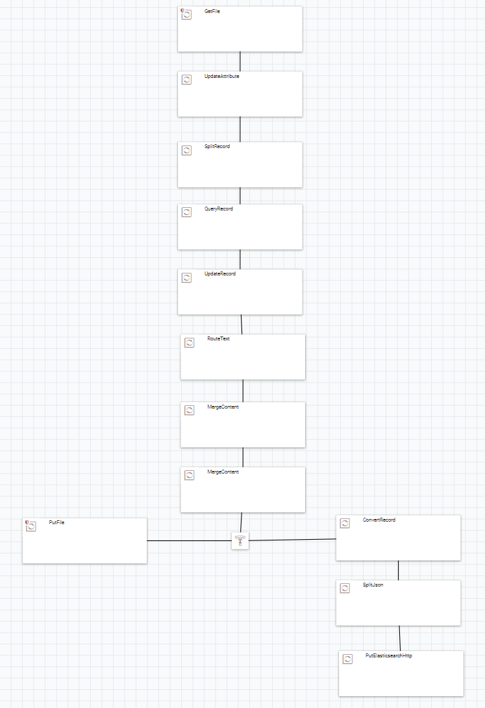
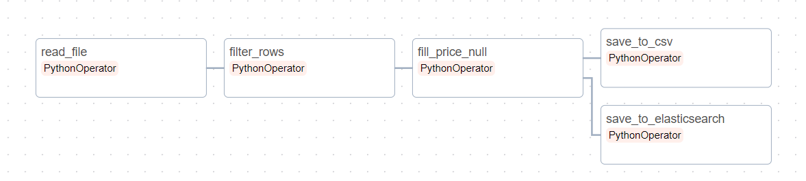
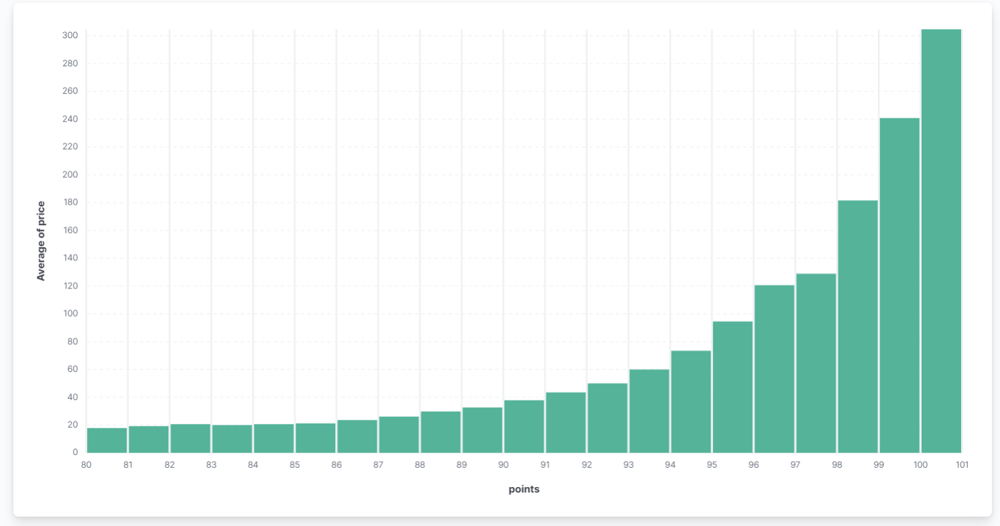

# Лабораторная работа 1

## Apache NiFi

Для реализации пайплайна были использованы процессоры находящиеся ниже:
1. `GetFile`: считывает файлы по шаблону **.csv** из указанной директории **(data/input/)**. Файлы после считывания удаляются.
2. `UpdateAttribute`: хитрый механизм для объединения данных из всех файлов в один.
3. `SplitRecord`: используется для разбинения получившегося файла на отдельные строки.
4. `QueryRecord`: фильтрует строки по переданному SQL запросу. Запрос представлен ниже:
```sql
SELECT * FROM FLOWFILE WHERE designation IS NOT NULL AND region_1 IS NOT NULL
```
5. `UpdateRecord`: проводим замену **null** на **0**. Проводится через параметр **/price** со значением **${field.value:replaceNull(0.0)}**.
6. `RouteText`: обрабытываем **header** csv файла. Для этого используем параметр **header** со значением **${lineNo:equals(1)}**.
7. `MergeRecord`: первый этап в процессе объединения данных. Увы, из за плохой механики объединения строк придется делать это в два этапа иначе пайплайн просто подвиснет с концами попытавшись обработать большое количество строк. Одна из причин почему все в основном используют **Airflow** :)
8. `MergeRecord`: второй этап мерджа. Из интересного тут мы навешиваем хэдеры на файл.
9. `PutFile`: сохраняем результаты в файл.
10. `ConvertRecord`: форматим данные в **json**, другое **ElasticSearch** не принимает.
11. `SplitJson`: разбиваем **list** из **json** в **json** по отдельности (опять же иначе следующий процессор не добавляет данные) 
12. `PutElasticsearchHttpRecord`: записываем данные в Elastic.

Схема пайплайна:


## Apache Airflow

Рассмотрим функции которые используются в пайплайне, ибо схема пайплайна осталась практически той же (ну только некоторые этапы подсократились)

1. `read_file`: считывает и объединяет данные с файлов в директории.
2. `filter_rows`: фильтрует строки по переданному условию.
3. `fill_null_price`: замена **null** на *0*.
4. `save_to_csv`: запись результатов в **csv** файл
5. `save_to_elasticsearch`: запись результатов в **ElasticSearch**

Схема пайплайна:


--------------------------------

Ниже представлена гистограмма зависимости средней цены вина от колличества очков выстваленных дегустатором

